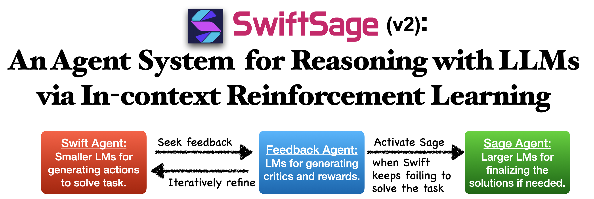

# 🤖 SwiftSage V2: An Agent System  for Reasoning with LLMs via In-context Reinforcement Learning 

<!-- add a banner img for s2_banner.png -->
<!-- add a banner img for s2_banner.png with a black border -->


> [!IMPORTANT]
> - This is the beta version of SwiftSage V2, which is still under development. The current version may not be stable and is subject to change. Any comments and suggestions are welcome! 
> - The code of SwiftSage V1 (for the experiments in NeurIPS 2023) is at [`science_world`](https://github.com/SwiftSage/SwiftSage/tree/science_world) branch.
> - 🔥 Our demo is now available on HuggingFace Spaces: [https://hf.co/spaces/swiftsage-ai/SwiftSage](https://hf.co/spaces/swiftsage-ai/SwiftSage). 


<!-- Github Readme Important Callout box note -->
## 🔗 Links:
- Gradio Demo on HuggingFace: https://hf.co/spaces/swiftsage-ai/SwiftSage
- Get your API key: [Together AI](https://www.together.ai), [Groq](https://groq.com/), [SambaNova](https://www.sambanova.ai), etc.
- Previous paper (NeurIPS 2023 Spotlight): https://arxiv.org/abs/2305.17390 
- Core contributors for v2: [Bill Yuchen Lin](https://yuchenlin.xyz/), [Yifan Song](https://scholar.google.com/citations?user=b_HfZhQAAAAJ&hl=en), .... 

## Installation

```bash
pip install git+https://github.com/SwiftSage/SwiftSage.git  
# alternatively, you can clone the repo and install it locally
# git clone https://github.com/SwiftSage/SwiftSage.git
# pip install -e .
```

## Usage

```bash
# export TOGETHER_API_KEY="your-api-key" # get your key from https://www.together.ai
export ENGINE="Together"
export SWIFT_MODEL_ID="meta-llama/Meta-Llama-3.1-8B-Instruct-Turbo" # can be 70B for more complex reasoning
export FEEDBACK_MODEL_ID="meta-llama/Meta-Llama-3.1-70B-Instruct-Turbo" 
export SAGE_MODEL_ID="meta-llama/Meta-Llama-3.1-70B-Instruct-Turbo" # can be 405B for more complex reasoning
QUERY="How many letter r are there in 'My strawberry is red.'?"
# QUERY="9.9 or 9.11 --  which is bigger?"
# QUERY="How can you solve the quadratic equation 3x^2 + 7.15x + 4 = 0 using the quadratic formula?"
# QUERY="What is the capital of Australia?"
swiftsage --problem $QUERY \
          --api_provider ${ENGINE} \
          --swift_model_id ${SWIFT_MODEL_ID} \
          --feedback_model_id ${FEEDBACK_MODEL_ID} \
          --sage_model_id ${SAGE_MODEL_ID}
```


<!-- ```bash
pip install git+https://github.com/SwiftSage/SwiftSage.git 
# export TOGETHER_API_KEY="your-api-key" # get your key from https://www.together.ai
swiftsage --problem "How many letter r are there in 'My strawberry is red.'?" \
          --api_provider "Together" \
          --swift_model_id "meta-llama/Meta-Llama-3.1-8B-Instruct-Turbo" \
          --feedback_model_id "meta-llama/Meta-Llama-3.1-70B-Instruct-Turbo" \
          --sage_model_id "meta-llama/Meta-Llama-3.1-70B-Instruct-Turbo"
```
 -->

<!--  

export SWIFT_MODEL_ID="meta-llama/Meta-Llama-3.1-8B-Instruct-Turbo"
export FEEDBACK_MODEL_ID="meta-llama/Meta-Llama-3.1-70B-Instruct-Turbo"
export SAGE_MODEL_ID="meta-llama/Meta-Llama-3.1-405B-Instruct-Turbo"

swiftsage --problem "9.9 or 9.11 --  which is bigger?" \
          --api_provider ${ENGINE} \
          --swift_model_id ${SWIFT_MODEL_ID} \
          --feedback_model_id ${FEEDBACK_MODEL_ID} \
          --sage_model_id ${SAGE_MODEL_ID} 

 -->
> [!Tip]
> Check more configurations in the code: [swiftsage/cli.py](swiftsage/cli.py).

## Design of SwiftSage V2 

The key motivation of SwiftSage is to provide a general reasoning framework that can mimic the fast and slow thinking processes in human cognition. The fast thinking process is based on the intuition and heuristic reasoning, while the slow thinking process is based on more analytical, critical thinking. Unlike SwiftSage V1, which relies on feedbacks from the well-designed environment such as ScienceWorld, SwiftSage v2 is designed to be more general and can be applied to various reasoning tasks. 

> [!Note]
> - **General reasoning.** In order to support more general reasoning, we use [Agent Lumos](https://arxiv.org/abs/2311.05657)'s idea to unify the task formats with a plan-ground-execute paradigm. Here to make our reasoning more general, we use Python executor as the execution engine, thus each action is a Python code snippet.
> - **In-context reinforcement.** Instead of fine-tuning by [behavior cloning](https://arxiv.org/abs/2311.05657) or[trajectory optimization](https://arxiv.org/abs/2403.02502), we focus on *tuning-free, prompting-based* strategies to achieve the same goal such that it is easier to adapt to new LLMs and API-based LLM access. The feedbacks are generated by LLMs and are used as critics and rewards for SwiftSage to update their reasoning strategies.

### SwiftSage Components

The main components in SwiftSage v2: 
- **Swift Agent**: A (smaller) LM that aims to solve the problem efficiently with intuitive reasoning.
- **Feedback Agent**: A (larger) LM that critiques the generated solution and provides feedback and reward signals.
- **Sage Agent**: A (even larger) LM that solves the problem by analytical thinking, if the Swift Agent fails.
- **Executor**: A Python executor that executes the generated code snippets to produce an answer.
- **Retriever** (soon to be added): A retrieval module that retrieves the most relevant tasks for the current prompt.


### SwiftSage Workflow

- Step 1. Given a reasoning problem input by a user, the Swift Agent first generates a plan and a code-based solution.
- Step 2. The executor runs the code snippet and produces the final answer.
- Step 3. The feedback agent then analyzes the generated answer and provides feedback, including a short paragraph and a score. Based on the score and a predefined threshold, we determine if the current solution is adequate to present to the user.
    - Case 3.1. If yes, the process stops, and the answer is shown to the user.
    - Case 3.2. If not, the critical feedback is used to prompt the Swift Agent to generate a new solution. Return to Step 1 with the feedback as the new prompt.
    - Case 3.3. If the new solution is still inadequate after several iterations, proceed to Step 4.
- Step 4. If the Swift Agent cannot solve the task, the Sage Agent is used to address the problem in a more analytical manner, and the final answer is then provided to the user.

> [!WARNING]  
> The Retriever is not yet implemented yet. Soon, we'll add retrieval augmentation step to further improve the reasoning process of Swift Agent in Step 1.


## Misc.

### Contact

Please email [Bill Yuchen Lin](https://yuchenlin.xyz) at the [gmail](yuchenlin1995@gmail.com) address.

### License
We use the MIT license for SwiftSage.

### Citation 
The technical report of SwiftSage V2 is under preparation. Please cite the following paper for the previous version of SwiftSage: 
```bib
@inproceedings{
  lin2023swiftsage,
  title={SwiftSage: A Generative Agent with Fast and Slow Thinking for Complex Interactive Tasks},
  author={Bill Yuchen Lin and Yicheng Fu and Karina Yang and Faeze Brahman and Shiyu Huang and Chandra Bhagavatula and Prithviraj Ammanabrolu and Yejin Choi and Xiang Ren},
  booktitle={Thirty-seventh Conference on Neural Information Processing Systems},
  year={2023}
}
```

### Star History

[](https://star-history.com/#SwiftSage/SwiftSage&Date)
